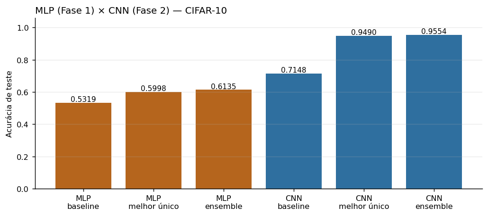
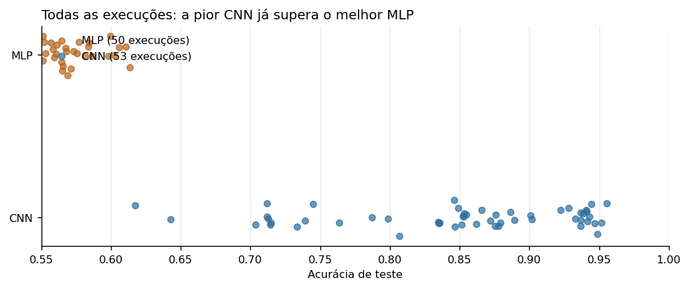
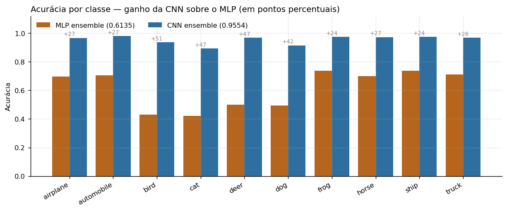

# Comparativo — MLP (Fase 1) × CNN (Fase 2)

Análise lado a lado das duas fases do Mini-projeto 1, ambas classificando o
CIFAR-10 (10 classes, imagens RGB 32×32) com a **mesma metodologia de busca**:
levas sucessivas de experimentos, cada uma informada pela anterior,
terminando num ensemble por soft voting sem retreino.

Como as duas fases usam o mesmo dataset, a mesma divisão de validação
(seed 42), as mesmas métricas e um esforço de busca comparável, os números são
diretamente confrontáveis — a diferença entre eles isola o efeito da
arquitetura.

## Estrutura

```
comparativo/
├── README.md
├── notebooks/
│   └── 01_comparativo_mlp_vs_cnn.ipynb   # só leitura: lê results/ das duas fases, não treina nada
├── scripts/
│   └── make_notebook.py                  # gera o notebook acima programaticamente
└── figures/                              # gráficos usados neste README
```

### Como rodar

```bash
cd miniprojeto/comparativo/notebooks
jupyter notebook 01_comparativo_mlp_vs_cnn.ipynb
```

Não precisa de GPU nem de download: o notebook só lê os `metadata.json` já
salvos em `../../fase1-mlp/results/` e `../../fase2-cnn/results/`, e roda em
segundos. Para regenerar o notebook do zero após mudar a análise:
`python scripts/make_notebook.py`.

---

# O placar

| | MLP (Fase 1) | CNN (Fase 2) | Diferença |
|---|---|---|---|
| Baseline | 0.5319 | 0.7148 | +18,3 p.p. |
| **Melhor modelo único** | 0.5998 | **0.9490** | **+34,9 p.p.** |
| **Melhor resultado geral (ensemble)** | 0.6135 | **0.9554** | **+34,2 p.p.** |
| Taxa de erro (ensemble) | 38,6% | **4,5%** | **−88,5%** |
| Execuções registradas | 50 | 56 | — |
| Levas de busca | 7 | 8 | — |



A CNN **reduziu a taxa de erro em 88,5%**: de 3.865 imagens erradas para 446,
das 10.000 do conjunto de teste.



Vale observar o gráfico acima com atenção: **a pior CNN de todas as 53
execuções (0.6175, um treino com learning rate alto demais e sem schedule)
ainda supera o melhor MLP encontrado depois de sete levas de busca (0.6135).**
Não há sobreposição entre as duas distribuições. Isso diz que a diferença
entre as arquiteturas é maior que toda a amplitude de variação de
hiperparâmetros dentro de cada família.

---

# Onde a convolução fez diferença

O ganho não foi uniforme entre as classes — e a forma como ele se distribui é
a evidência mais direta de *por que* a convolução funciona. Se a CNN fosse
apenas "uma rede maior", o ganho seria parecido em todas as classes.



| Classe | MLP (ensemble) | CNN (ensemble) | Ganho | Grupo |
|---|---|---|---|---|
| bird | 0.429 | 0.937 | **+50,8 p.p.** | animal |
| cat | 0.421 | 0.893 | **+47,2 p.p.** | animal |
| deer | 0.500 | 0.969 | **+46,9 p.p.** | animal |
| dog | 0.495 | 0.915 | +42,0 p.p. | animal |
| automobile | 0.707 | 0.981 | +27,4 p.p. | veículo |
| horse | 0.701 | 0.973 | +27,2 p.p. | animal |
| airplane | 0.696 | 0.967 | +27,1 p.p. | veículo |
| truck | 0.710 | 0.969 | +25,9 p.p. | veículo |
| frog | 0.738 | 0.975 | +23,7 p.p. | animal |
| ship | 0.738 | 0.975 | +23,7 p.p. | veículo |

| Grupo | MLP | CNN | Ganho médio |
|---|---|---|---|
| Animais (6 classes) | 0.5473 | 0.9437 | **+39,6 p.p.** |
| Veículos (4 classes) | 0.7128 | 0.9730 | +26,0 p.p. |

O ganho médio nos animais é **mais de 50% maior** que o ganho nos veículos, e
as três classes mais beneficiadas (`bird`, `cat`, `deer`) eram exatamente as
três piores do MLP.

Isso tem uma explicação direta e verificável. Veículos têm silhueta rígida e
aparecem sobre fundos consistentes — céu para aviões, mar para navios, asfalto
para carros. Um MLP, mesmo achatando a imagem num vetor de 3.072 valores,
consegue capturar parte disso: a distribuição global de cores e o contorno
grosseiro já separam razoavelmente um navio de um cavalo. Animais, ao
contrário, dependem de **textura local** (pelo, penas, escamas) e aparecem em
poses muito variadas — informação que só existe na relação espacial entre
pixels vizinhos, que é precisamente o que o achatamento destrói e a convolução
preserva.

Em outras palavras: a CNN não ganhou por ser maior, ganhou por olhar a imagem
do jeito certo. O MLP campeão tem ~1,9 milhão de parâmetros e a CNN campeã
~4,8 milhões — 2,5× mais, o que não explicaria um salto de 34 p.p. num
problema onde aumentar a capacidade do MLP já havia saturado.

---

# O que sobrou de erro em cada fase

| | Erros totais (de 10.000) | `cat` | `dog` | `bird` | `cat`+`dog` como % do erro |
|---|---|---|---|---|---|
| MLP (ensemble) | 3.865 | 579 | 505 | 571 | 28,0% |
| CNN (ensemble) | 446 | 107 | 85 | 63 | **43,0%** |

As mesmas classes lideram os erros nas duas fases, mas a **concentração
aumentou**: no MLP o erro estava espalhado por todas as classes de animais; na
CNN, `cat` e `dog` sozinhos respondem por quase metade do que sobrou, mais que
o dobro da sua participação proporcional (20%).

É um sinal saudável de progresso. A CNN resolveu tudo que era resolvível com
estrutura espacial e parou no que é intrinsecamente ambíguo: distinguir dois
animais peludos de quatro patas numa imagem de 32×32 pixels, onde às vezes nem
um humano acerta com confiança.

---

# O que as duas buscas ensinaram em comum

Rodar a mesma metodologia duas vezes, em famílias de modelo diferentes,
permite separar o que é lição sobre *o problema* do que é lição sobre *a
arquitetura*.

## Seis alavancas se comportaram igual nas duas fases

| Alavanca | MLP | CNN |
|---|---|---|
| Data augmentation (crop + flip) | ajudou muito | ajudou muito |
| Color jitter | **piorou** | **piorou** |
| Normalização "real" do CIFAR-10 | **piorou** | **piorou** |
| Mais épocas depois de adicionar augmentation | ajudou muito | ajudou muito |
| Ensemble por soft voting | ajudou muito | ajudou muito |
| Aumentar capacidade | ajudou até saturar | ajudou até saturar |

Essas dizem respeito ao problema, não à arquitetura. Duas merecem destaque
porque são contra-intuitivas e se repetiram: **color jitter piorou nas duas
fases** (perturbar cor remove informação que ambos os modelos usam), e a
**normalização estatisticamente "mais correta" também piorou nas duas** —
provavelmente porque, com batch normalization presente, a escolha da
normalização de entrada perde relevância.

## Três alavancas inverteram de sinal

| Alavanca | MLP | CNN |
|---|---|---|
| Weight decay | melhor em **zero** | melhor em **5e-4** |
| SGD vs. Adam | **Adam** melhor | **SGD+momentum** melhor (+3 p.p.) |
| Composição do ensemble | poucos membros bem escolhidos | **todos os 7** |

Essas dizem respeito à família de modelo, e são as mais instrutivas:

**Weight decay.** No MLP, com batch norm e dropout já presentes, qualquer L2
extra atrapalhava a convergência — o melhor valor era zero. Na CNN, 5e-4 foi a
alavanca vencedora de uma leva inteira (+1,74 p.p.). Redes convolucionais
profundas têm muito mais parâmetros compartilhados e se beneficiam de uma
restrição explícita na norma dos pesos.

**Otimizador.** No MLP, SGD com momentum ficou no meio da tabela e Adam foi
mantido como padrão. Na CNN, a mesma arquitetura VGG treinada com Adam chegou
a ~0.90 e com SGD+momentum+cosine a ~0.93 — **3 pontos percentuais de
diferença**, só trocando o otimizador. A vantagem do SGD só aparece quando a
rede fica funda.

**Composição do ensemble.** Esta é a inversão mais interessante. No MLP,
incluir os modelos de maior acurácia individual *piorou* o ensemble
(`search_top5_by_accuracy` = 0.6024, abaixo de um ensemble de apenas 3 membros
bem escolhidos) — membros treinados com a mesma receita erravam da mesma forma
e diluíam a média. Na CNN aconteceu o oposto: usar os 7 modelos, incluindo os
três empatados em 0.9370, bateu usar só os 3 melhores (0.9554 contra 0.9519).

A regra por trás é a mesma nos dois casos — **o que importa é a diversidade
dos erros, não a acurácia individual dos membros**. O que mudou foi que, na
CNN, cada um dos sete tinha sido treinado com um regularizador diferente
(dropout, weight decay alto, label smoothing, TrivialAugment, RandAugment), de
modo que mais membros significavam mais diversidade. No MLP, os membros de alta
acurácia vinham todos da mesma receita, então mais membros significavam mais
redundância.

## A lição transversal

Nas duas fases, o padrão foi idêntico: a busca satura dentro de uma categoria
de alavanca, e o ganho volta quando se **troca de categoria**, não quando se
ajusta melhor a alavanca que já se estava usando.

No MLP, a busca de arquitetura/ativação/regularização/LR travou em ganhos de
+0,57 p.p. por rodada até a rodada 6 introduzir augmentation e schedule
(+0,93 p.p.) e a rodada 7 mais épocas (+1,35 p.p.).

Na CNN, a leva 3 rendeu **exatamente zero** — nenhuma das configurações que
esticavam o vencedor anterior o superou. Foi esse fracasso que motivou buscar
weight decay (leva 4), depois arquitetura VGG (leva 6, +4,79 p.p.) e depois
MixUp/CutMix (leva 8), cada um deles um eixo novo.

---

# Custo

| | MLP campeão | CNN campeã |
|---|---|---|
| Parâmetros | ~1,9 M | ~4,8 M |
| Épocas | 55 | 200 |
| Tempo por execução | ~1 h (CPU) | ~3-4 h (GPU) |
| Acurácia | 0.5998 | 0.9490 |

A CNN tem 2,5× mais parâmetros, mas o custo real está no tempo: cada filtro
convolucional é reaplicado em todas as posições da imagem, então o número de
operações por época é muito maior que o número de parâmetros sugere. A Fase 2
exigiu GPU e sessões de várias horas, contra treinos de CPU na Fase 1.

Em compensação, o ensemble da CNN saiu **de graça** — os sete modelos já
existiam da busca, e combiná-los custou um único forward pass no conjunto de
teste, rendendo +0,64 p.p. sobre o melhor modelo individual.

---

# Conclusão

A convolução valeu **+34,2 pontos percentuais** sobre a melhor configuração de
MLP encontrada com esforço de busca equivalente — uma redução de 88,5% na taxa
de erro. O ganho concentrou-se exatamente onde a teoria previa: nas classes que
dependem de textura local e pose variável em vez de silhueta global.

Mas o salto não veio de graça só por trocar de arquitetura. A CNN baseline
(0.7148) já superava qualquer MLP, e ainda assim foram necessárias **oito
levas de busca** para chegar a 0.9554. A arquitetura abriu o teto; a busca de
hiperparâmetros preencheu os 24 pontos percentuais entre o baseline
convolucional e o resultado final. As duas coisas foram necessárias.

Relatórios completos de cada fase: [`../fase1-mlp/README.md`](../fase1-mlp/README.md)
e [`../fase2-cnn/README.md`](../fase2-cnn/README.md).
