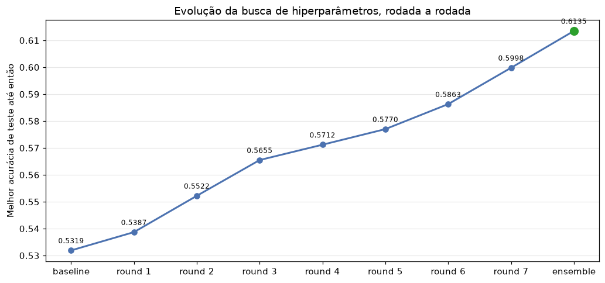
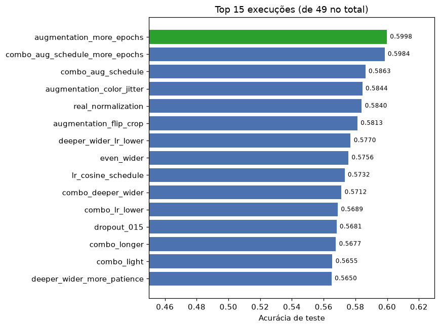
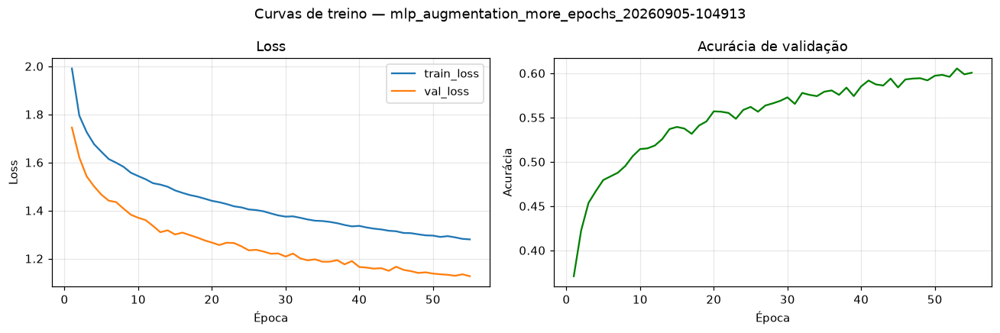
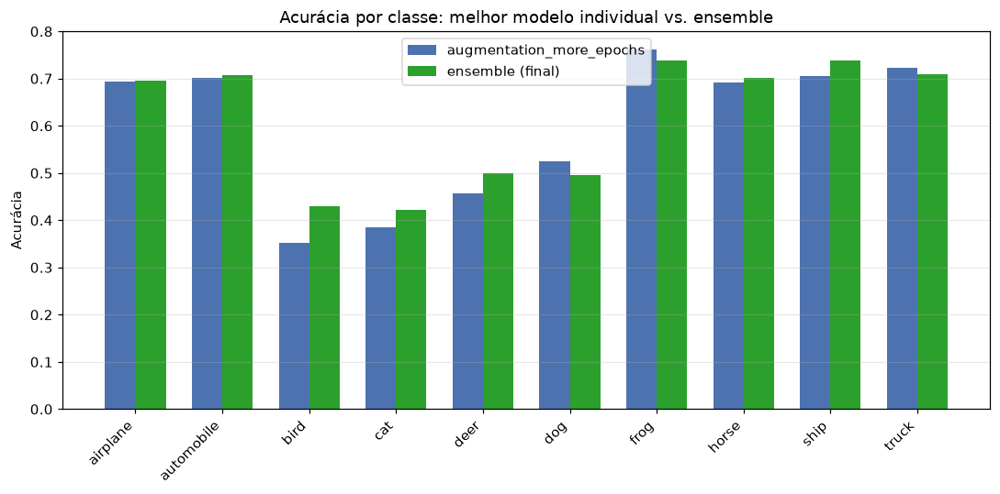
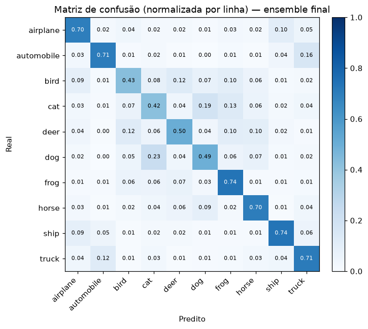

# Fase 1 — MLP para classificar o CIFAR-10

Treinar um **MLP (Multi-Layer Perceptron)** para classificar as imagens do
CIFAR-10 (10 classes, imagens RGB 32x32), buscando os melhores hiperparâmetros.

## Estrutura

```
fase1-mlp/
├── README.md
├── pyproject.toml          # torna o pacote instalável (pip install -e .)
├── requirements.txt
├── src/mlp_cifar10/        # código reutilizável
│   ├── config.py           # ExperimentConfig: todos os hiperparâmetros de um experimento
│   ├── data.py              # download do CIFAR-10 + DataLoaders (treino/val/teste)
│   ├── model.py             # classe MLP (nº de camadas/neurônios, ativação, dropout, batch norm parametrizáveis)
│   ├── metrics.py           # métricas globais + acurácia por classe
│   ├── train.py             # loop de treino/avaliação com early stopping
│   └── checkpointing.py     # skill `model-saver`: salva model.pt + metadata.json de cada execução
├── notebooks/
│   ├── 01_train_mlp_cifar10.ipynb   # define e roda os experimentos (treino)
│   └── 02_results_report.ipynb      # só leitura: gera os gráficos do relatório a partir de results/, sem treinar nada
├── scripts/
│   ├── run_experiments.py  # baterias adicionais de experimentos (rounds de busca de hiperparâmetros), fora do notebook
│   └── ensemble_eval.py    # ensemble (soft voting) dos melhores modelos já treinados, sem retreinar
├── data/                    # CIFAR-10 baixado automaticamente (não versionado)
└── results/                 # results/{model_id}/ — uma pasta por execução de treino, versionado (pesos + metadados)
    └── plots/report/        # gráficos gerados por 02_results_report.ipynb, usados neste README
```

Essa separação entre `src/` (implementação) e `notebooks/` (orquestração de
experimentos + relatório) é o padrão recomendado para projetos de data
science: mantém o notebook curto e legível — o que importa para quem vai
avaliar o PPT/relatório — enquanto o código testável e reaproveitável fica
isolado em módulos.

## Como rodar

### Local

```bash
cd miniprojeto/fase1-mlp
python -m venv .venv && source .venv/bin/activate   # ou .venv\Scripts\activate no Windows
pip install -e .
jupyter notebook notebooks/01_train_mlp_cifar10.ipynb
```

### Google Colab

Abra `notebooks/01_train_mlp_cifar10.ipynb` no Colab e rode a primeira célula
de setup — ela clona o repositório e instala o pacote automaticamente
(edite a variável `REPO_URL` na célula para apontar para este repositório).

## Cada execução de treino é salva automaticamente (skill `model-saver`)

`train.fit(...)` chama `checkpointing.save_run(...)` ao final de cada
execução, que por sua vez implementa a skill **model-saver** do usuário
(variante PyTorch). É criada uma pasta própria `results/{model_id}/`, com
`model_id` único (`mlp_{run_name}_{timestamp}`, nunca reutilizado entre
execuções), contendo:

- `model.pt` — pesos do modelo (`model.state_dict()`);
- `metadata.json` — hiperparâmetros, arquitetura, dataset e métricas, no
  schema padrão da skill (`model_id`, `framework`, `timestamp`,
  `hyperparameters`, `metrics`, `architecture`, `dataset`, `notes`, ...);
- `history.csv` — extra: loss/acurácia de validação por época (para plotar curvas).

Para comparar todas as execuções já salvas (não só as da sessão atual do
notebook), use `checkpointing.load_all_metadata(results_dir)` — ver a seção
"Comparando todas as execuções salvas" do notebook.

## O que reportar (ver também `../README.md`)

- Hiperparâmetros investigados e resultado de cada variação (a tabela
  comparativa gerada na seção 2 do notebook é o ponto de partida).
- Acurácia por classe e métricas globais (acurácia, precision, recall) no
  conjunto de teste.
- Parâmetros sugeridos para variar: número de camadas, número de neurônios,
  taxa de aprendizagem, função de ativação, regularização (weight decay),
  otimizador, dropout, função de erro (entropia cruzada / MSE).

## Relatório do experimento: busca de hiperparâmetros

### Objetivo e metodologia

Além dos 17 experimentos originais do notebook (que cobrem cada hiperparâmetro
isoladamente — ativação, otimizador, batch size, dropout, weight decay, etc.),
foi feita uma busca guiada em **7 rodadas** de 3-5 configurações cada
(32 execuções via `scripts/run_experiments.py`), totalizando **49 execuções**
registradas em `results/`, mais uma busca de composição de **ensemble** por
soft voting (4 combinações testadas em `scripts/ensemble_eval.py`, sem
retreinar nada). A cada rodada, o(s) melhor(es) resultado(s) da rodada
anterior foram usados para decidir a próxima bateria de testes (busca
gulosa/coordenada, não uma grade exaustiva) — cada rodada testa uma hipótese
específica derivada da rodada anterior, não combinações aleatórias.

Todas as execuções usam CIFAR-10 (45.000 treino / 5.000 validação / 10.000
teste), Adam como otimizador padrão e entropia cruzada como perda, exceto
onde indicado.

### Evolução da acurácia de teste, rodada a rodada

| Rodada | Melhor config | Acurácia | Ganho sobre a rodada anterior |
|---|---|---|---|
| Baseline (17 experimentos originais) | `best_combo` — `[256,128,64,32]`, relu, dropout 0.3, batch norm, weight_decay 1e-4 | 0.5319 | — |
| 1 | `even_deeper` — rede mais larga `[384,192,96,48]` | 0.5387 | +0,68 p.p. |
| 2 | `no_weight_decay` — remove weight decay | 0.5522 | +1,35 p.p. |
| 3 | `combo_light` — gelu + dropout 0.2 + sem weight decay (combina os 3 vencedores da rodada 2) | 0.5655 | +1,33 p.p. |
| 4 | `combo_deeper_wider` — rede ainda maior `[512,256,128,64,32]` | 0.5712 | +0,57 p.p. |
| 5 | `deeper_wider_lr_lower` — mesma rede + learning rate menor (5e-4) | 0.5770 | +0,58 p.p. |
| 6 | `combo_aug_schedule` — mesma rede + data augmentation (flip/crop) + LR cosine annealing | 0.5863 | +0,93 p.p. |
| 7 | `augmentation_more_epochs` — mesma rede + augmentation, 55 épocas em vez de 40 | **0.5998** | +1,35 p.p. |
| — | **Ensemble (soft voting)** dos 3 modelos mais diversos, sem retreinar | **0.6135** | +1,37 p.p. sobre o melhor individual |

O ganho por rodada tinha caído para +0,57-0,58 p.p. nas rodadas 4 e 5 —
retornos decrescentes claros dentro do espaço já explorado (arquitetura,
ativação, regularização, learning rate). A rodada 6 testou **duas alavancas
de um tipo diferente** (data augmentation e LR schedule) e reverteu essa
tendência: +0,93 p.p., maior que o ganho das duas rodadas anteriores juntas —
sinal de que augmentation/schedule atacam uma fonte de erro diferente
(overfitting/instabilidade de convergência) da que os hiperparâmetros de
arquitetura já haviam esgotado. A rodada 7 confirmou a suspeita de que os
modelos com augmentation da rodada 6 não tinham convergido: dar mais 15
épocas (`augmentation_more_epochs`, 55 no total) rendeu +1,35 p.p., o maior
ganho de uma única rodada desde a rodada 2. Já normalização real do CIFAR-10
e augmentation mais forte (color jitter), também testadas na rodada 7,
**pioraram** ligeiramente o resultado (0.5840 e 0.5844 vs. 0.5863 do
baseline da rodada) — nem toda alavanca nova ajuda. O ensemble, por fim,
ataca uma fonte de erro diferente de todas as anteriores (variância entre
modelos) e deu o maior resultado absoluto — mas só depois de uma busca pela
melhor *composição* de membros (ver abaixo), não só pegando os de maior
acurácia individual.





*(Gráficos gerados por `notebooks/02_results_report.ipynb`, que só lê `results/` — não retreina nada.)*

### Configuração vencedora final

**Melhor modelo individual — `mlp_augmentation_more_epochs`** — acurácia de
teste **0.5998** (F1 0.5942), 55 épocas (sem early stopping — ainda
melhorando):

| Hiperparâmetro | Valor |
|---|---|
| Arquitetura | `[512, 256, 128, 64, 32]` (funil profundo de 5 camadas ocultas) |
| Ativação | GELU |
| Dropout | 0.2 |
| Batch Normalization | Sim |
| Weight decay (L2) | 0.0 |
| Learning rate | 5e-4 fixo |
| Data augmentation | `RandomCrop(32, padding=4)` + `RandomHorizontalFlip()` no treino |
| Otimizador | Adam |

**Busca de composição do ensemble**: testamos 4 combinações antes de
escolher a final — o resultado mais importante foi que **diversidade de
regime de treino importa mais que acurácia individual bruta**:

| Ensemble | Membros | Acurácia |
|---|---|---|
| `top3` (rodada 6) | `combo_aug_schedule`, `augmentation_flip_crop`, `deeper_wider_lr_lower` | 0.6058 |
| `top5` | os 5 melhores por acurácia individual (incluindo `real_normalization` e `augmentation_color_jitter`, ambos mais fracos) | 0.6024 (pior que o `top3`!) |
| `top4_v2` | os 2 melhores da rodada 7 + `combo_aug_schedule` + `deeper_wider_lr_lower` | 0.6105 |
| **`final`** | `augmentation_more_epochs`, `combo_aug_schedule_more_epochs`, `deeper_wider_lr_lower` | **0.6135** |

Adicionar os modelos de maior acurácia individual (`top5`) piorou o
resultado — dois membros mais fracos (0.584) diluíram a média sem
acrescentar diversidade real (erram de forma parecida aos outros). Já trocar
um membro correlacionado (`combo_aug_schedule`, mesma receita que
`combo_aug_schedule_more_epochs`) por um modelo de regime bem diferente
(`deeper_wider_lr_lower`, sem augmentation) manteve só 3 membros e ainda
assim rendeu mais — 3 membros bem diversos > 4-5 membros com redundância.

**Melhor resultado geral — ensemble final (soft voting) de 3 modelos** —
acurácia de teste **0.6135** (F1 0.6102), combinando as probabilidades
(softmax) de `augmentation_more_epochs` (0.5998), `combo_aug_schedule_more_epochs`
(0.5984, mesma arquitetura + augmentation + cosine annealing) e
`deeper_wider_lr_lower` (0.5770, sem augmentation — o membro "diferente" que
dá diversidade ao ensemble), sem nenhum retreino — ver
`scripts/ensemble_eval.py` e `results/mlp_ensemble_final_softvote/metadata.json`.

Acurácia por classe (melhor modelo individual vs. ensemble final):

| Classe | `augmentation_more_epochs` | Ensemble (final) | Diferença |
|---|---|---|---|
| airplane | 0.693 | 0.696 | +0,3 p.p. |
| automobile | 0.702 | 0.707 | +0,5 p.p. |
| bird | 0.353 | 0.429 | +7,6 p.p. |
| cat | 0.386 | 0.421 | +3,5 p.p. |
| deer | 0.457 | 0.500 | +4,3 p.p. |
| dog | 0.525 | 0.495 | −3,0 p.p. |
| frog | 0.762 | 0.738 | −2,4 p.p. |
| horse | 0.692 | 0.701 | +0,9 p.p. |
| ship | 0.706 | 0.738 | +3,2 p.p. |
| truck | 0.722 | 0.710 | −1,2 p.p. |

O ensemble melhora 7 das 10 classes — com destaque para as mais fracas do
modelo individual (`bird` +7,6 p.p., `deer` +4,3 p.p., `cat` +3,5 p.p.), que
é exatamente onde mais precisava melhorar. Em compensação, piora um pouco em
3 classes onde o modelo individual já ia bem (`dog`, `frog`, `truck`) — soft
voting reduz a variância média do conjunto e puxa classes muito boas de um
membro específico para perto da média dos outros dois, não garante melhora
em toda classe individualmente.







A matriz de confusão do ensemble (normalizada por linha) confirma exatamente
os pares de classes que um MLP sem estrutura espacial mais confunde — e
quantifica o quanto:

- **`cat` ↔ `dog`**: 19% dos gatos são classificados como cachorro e 23% dos
  cachorros como gato — de longe a maior confusão da matriz.
- **`automobile` ↔ `truck`**: 16% dos carros viram caminhão e 12% dos
  caminhões viram carro — dois veículos de rodas com silhueta retangular
  similar em baixa resolução (32×32).
- **`airplane` ↔ `ship`**: 10% dos aviões viram navio e 9% dos navios viram
  avião — ambos tendem a aparecer como uma forma alongada sobre um fundo
  claro/uniforme (céu ou mar), o que um MLP sem noção de contexto/textura
  espacial não distingue bem.
- As classes com melhor acurácia no ensemble (`ship`/`frog` 0.74,
  `automobile`/`truck` ~0.71, `airplane`/`horse` ~0.70) são as que têm
  silhueta ou cor de fundo mais consistente entre exemplos; as piores
  (`cat` 0.42, `bird` 0.43, `dog` 0.50, `deer` 0.50) são majoritariamente
  classes de animais com pose e textura variáveis — reforça o limite
  estrutural do MLP discutido a seguir.

Padrão recorrente em **todos** os 49 experimentos, não só nos melhores:
veículos e cenários com silhueta bem definida (`ship`, `frog`, `automobile`,
`airplane`) são consistentemente as classes mais fáceis; animais com pose e
textura variáveis (`cat`, `dog`, `bird`, `deer`) são as mais difíceis — `cat`
e `dog` frequentemente se confundem entre si, e continuam sendo o gargalo
mesmo no melhor resultado (`cat` = 0.421 no ensemble, a classe mais fraca de
todas). Isso é esperado para um MLP: sem convolução, o modelo não tem
nenhuma noção de invariância translacional ou de textura local, então
classes que dependem de forma/silhueta global se saem melhor do que classes
que dependem de padrões locais (pelo, textura).

### O que a busca revelou sobre cada hiperparâmetro

- **Arquitetura (capacidade)**: aumentar largura/profundidade ajudou de forma
  consistente e foi o fator de maior impacto isolado — `[64,128,64]` (baseline
  original, ~0.51) → `[256,128,64,32]` (~0.53) → `[384,192,96,48]` (~0.55) →
  `[512,256,128,64,32]` (~0.57). Porém isso satura: ir além (6 camadas, ou
  `[768,384,192,96,48]`) não trouxe ganho adicional consistente
  (`six_layer_combo` = 0.5609, pior que a versão de 5 camadas equivalente).
- **Regularização (dropout/weight decay)**: existe um ponto ótimo estreito.
  Dropout 0.2 bateu tanto valores maiores (0.3, 0.5 — nos dois casos as
  piores execuções do conjunto, chegando a 0.4668–0.4692) quanto menores
  (0.1 — deu early stopping prematuro por overfitting rápido, 0.5529).
  Weight decay, surpreendentemente, funcionou melhor em **zero**: com
  batch norm + dropout já presentes, a penalização L2 extra só atrapalhava
  a convergência (valores de 1e-3 caíram para ~0.466-0.467, entre os piores
  do estudo todo).
- **Ativação**: GELU superou ReLU de forma pequena mas consistente nas
  arquiteturas maiores (a mesma rede com ReLU no lugar de GELU rendeu 0.5571
  vs. 0.5712/0.5770 com GELU — cerca de 1,4-2 p.p. a menos). Tanh e Sigmoid-like
  (LeakyReLU) ficaram atrás de ReLU/GELU desde o início.
- **Learning rate**: 1e-3 (padrão do Adam) era um bom ponto de partida, mas ao
  aumentar a capacidade da rede um LR levemente menor (5e-4) convergiu para
  um ótimo melhor; LR maior (2e-3) piorou (0.5584). LR muito baixo (1e-4) ou
  muito alto (5e-3) nos experimentos originais já haviam mostrado prejuízo
  claro (0.5091 e 0.4769 respectivamente).
- **Otimizador/perda**: SGD com momentum e a perda MSE (testados nos
  experimentos originais) ficaram no meio da tabela, sem vantagem sobre
  Adam + entropia cruzada, que foi mantido fixo daí em diante.
- **Batch size**: batch maior (256, testado no baseline) não trouxe ganho.
- **Efeito combinado**: combinar os vencedores individuais de uma rodada
  (round 3: gelu + dropout 0.2 + sem weight decay) rendeu mais do que
  qualquer um isoladamente — os efeitos de arquitetura, ativação e
  regularização são majoritariamente aditivos/independentes entre si nesta
  faixa de valores. O mesmo padrão se repetiu na rodada 6: augmentation
  sozinha (0.5813) + cosine schedule sozinho (0.5732) somados superam os
  dois isoladamente (0.5863 combinados) — reforça que, dentro do espaço
  testado, cada alavanca ataca uma fonte de erro distinta.
- **Data augmentation** (`RandomCrop(32, padding=4)` + `RandomHorizontalFlip()`,
  rodada 6): o ganho isolado mais alto de toda a busca (+4,3 p.p. sobre a
  mesma arquitetura sem augmentation, 0.5770 → 0.5813) — e o modelo ainda não
  tinha convergido em 40 épocas, sugerindo espaço para mais. Custo: ~3x mais
  lento por época em CPU sem `num_workers` (crop/flip por amostra, sem
  paralelismo), então cada execução com augmentation levou ~1h em vez de
  ~10-20 min.
- **LR schedule** (cosine annealing, rodada 6): isoladamente ficou levemente
  **abaixo** do LR fixo mais bem ajustado (0.5732 vs. 0.5770), mas combinado
  com augmentation superou os dois (0.5863) — o schedule parece ajudar mais
  quando há mais "ruído" para estabilizar no fim do treino (introduzido pela
  augmentation) do que em treino sem augmentation, onde o LR fixo bem
  ajustado (5e-4) já bastava.
- **Mais épocas com augmentation** (rodada 7): `augmentation_flip_crop` e
  `combo_aug_schedule` (rodada 6) tinham parado em 40 épocas ainda
  melhorando. Dar mais espaço (55 épocas, `augmentation_more_epochs`) rendeu
  +1,35 p.p. (0.5863 → 0.5998 no melhor da família) — o segundo maior ganho
  de rodada de toda a busca, confirmando que o modelo realmente não tinha
  convergido.
- **Normalização real do CIFAR-10** (média/desvio-padrão reais em vez de
  simplesmente [-1,1], rodada 7): **piorou** ligeiramente (0.5840 vs. 0.5863
  do baseline da rodada) — contra-intuitivo, já que normalização real é
  estatisticamente "mais correta", mas nesta arquitetura/regime não ajudou.
  Hipótese: batch norm já absorve boa parte do benefício de uma normalização
  de entrada melhor, tornando a escolha de mean/std de entrada menos
  relevante.
- **Augmentation mais forte** (crop+flip+color jitter, rodada 7): também
  **piorou** ligeiramente (0.5844 vs. 0.5863) — jitter de cor parece remover
  informação de cor que o MLP usa como atalho útil (já que não tem acesso a
  textura/forma via convolução) — mais augmentation nem sempre é melhor.
- **Ensemble** (soft voting, sem retreinar): maior ganho isolado de toda a
  busca em termos absolutos (+1,37 p.p. sobre o melhor individual, 0.5998 →
  0.6135), e de graça computacionalmente (usa checkpoints já salvos). O
  achado mais interessante aqui não foi o ganho em si, mas **como compor o
  ensemble**: testamos 4 combinações (ver tabela acima) e a que só pegava os
  5 modelos de maior acurácia individual (`top5`) foi *pior* que usar só 3
  modelos bem escolhidos (`top3`/`final`) — membros correlacionados (mesma
  receita de treino) ou fracos diluem a média em vez de ajudar; o que importa
  é ter membros que erram de forma parcialmente independente.

### Dá para melhorar mais, ou já chegou no limite?

**Resposta confirmada empiricamente, em duas rodadas de teste**: ainda dava
para melhorar dentro da família MLP. As alavancas testadas nas rodadas 6-7
(augmentation, LR schedule, mais épocas, ensemble) levaram a acurácia de
0.5770 para **0.6135** (+3,65 p.p.), mais que o dobro do ganho de qualquer
rodada anterior de busca de hiperparâmetros "tradicional" (arquitetura/
ativação/regularização/LR, que já tinha saturado em ~+0,57-0,58 p.p. por
rodada). Isso mostra que "retornos decrescentes" valia **para o tipo de
alavanca já testado**, não para o MLP como família — trocar de categoria de
alavanca (regularização de dados em vez de regularização do modelo; combinar
modelos em vez de tunar um só) reabriu ganho real, duas vezes seguidas.

Mas a rodada 7 também mostrou os primeiros sinais reais de **retornos
decrescentes até para as alavancas novas**: 2 das 4 frentes testadas
(normalização real, augmentation mais forte) pioraram o resultado em vez de
melhorar — a primeira vez em 7 rodadas que uma categoria inteira de alavanca
nova (não só um valor extremo dela) deu resultado negativo. Isso sugere que
a região de "alavancas baratas ainda não testadas" está se esgotando de
verdade agora, não só aparentando esgotar como em rodadas anteriores.

**Para um MLP puro, agora sim parece estar perto de um teto mais sério** —
a maior parte das alavancas testáveis com esforço razoável (arquitetura,
ativação, regularização, LR, augmentation leve/forte, schedule, mais
épocas, normalização, ensemble) já foi testada:

- Um MLP achata a imagem 32×32×3 num vetor de 3072 valores e perde toda
  estrutura espacial: não há invariância translacional nem detecção de
  padrões locais (bordas, texturas). Isso continua visível mesmo no melhor
  resultado — `cat` (0.421) e `bird` (0.429) seguem as classes mais fracas
  do ensemble, exatamente as que mais dependem de textura/pose em vez de
  silhueta global. Nenhuma das alavancas testadas resolve essa limitação
  estrutural, só mitiga seus sintomas (menos overfitting, menos variância).
- Redes CNN convolucionais tipicamente alcançam 70-90%+ em CIFAR-10 com
  esforço de tuning comparável, justamente porque exploram essa estrutura
  espacial que o MLP ignora — o que também explica por que este projeto já
  prevê uma `fase2-cnn` como próxima etapa.

**Alavancas que ainda não foram testadas e poderiam render mais alguns
pontos**, em ordem aproximada de impacto esperado / esforço — mas com
expectativa mais modesta agora que 2 das 4 frentes da rodada 7 já vieram
negativas:

1. **Épocas ainda maiores** (80-100+) para `augmentation_more_epochs` — a
   curva de validação ainda não achatou de vez, mas o ganho marginal por
   época tende a cair.
2. **`Cutout`/`Mixup`** (formas de augmentation mais estruturadas que color
   jitter, que não ajudou) — mascarar regiões da imagem ou misturar pares de
   imagens/rótulos, em vez de perturbar cor/geometria.
3. **Ensemble maior com seeds novas** (treinar 2-3 seeds adicionais da
   melhor config, em vez de só recombinar modelos já existentes) — mais caro
   (exige retreino), mas potencialmente mais diverso que recombinar o que já
   existe.
4. Grid fino em torno de dropout 0.2/lr 5e-4 — a busca já indica que a
   região é estreita e plana ali perto, então retorno esperado é baixo.

Resumindo: o MLP surpreendeu ao render mais do que o esperado inicialmente
(pulou de um platô aparente de ~0.577 para 0.6135) ao mudar de categoria de
alavanca duas vezes seguidas (rodadas 6 e 7) — mas a rodada 7 também trouxe
o primeiro sinal claro de que essa fonte de ganho está se esgotando (2 de 4
frentes pioraram o resultado). O limite estrutural (perda da estrutura 2D da
imagem) continua sendo o teto real, visível nas classes de animais que nunca
passam de ~0.4-0.5 mesmo no melhor resultado. Para um salto de outra ordem de
grandeza (70-90%+), o caminho é migrar para convolução (`fase2-cnn`).
