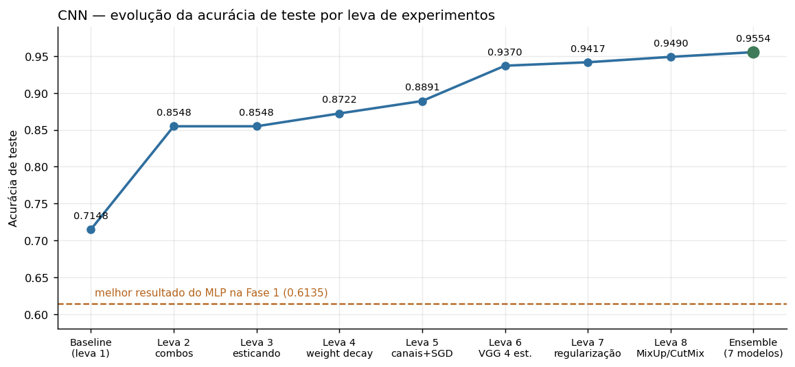
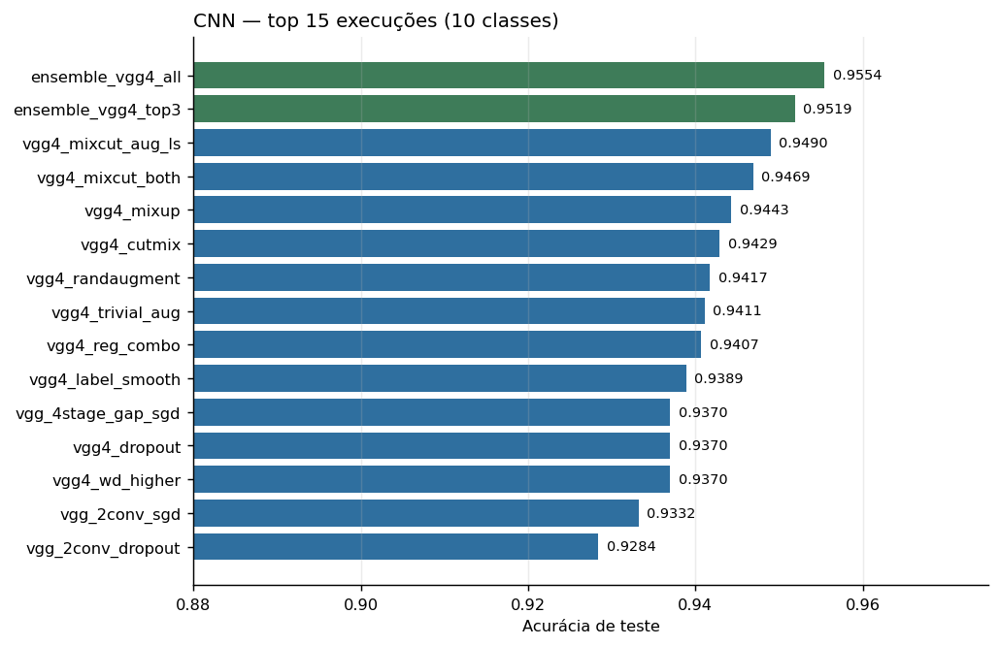
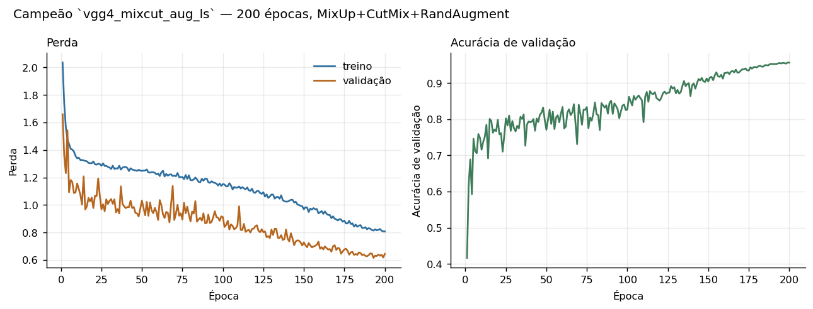
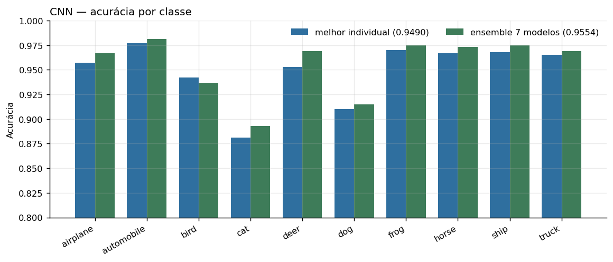
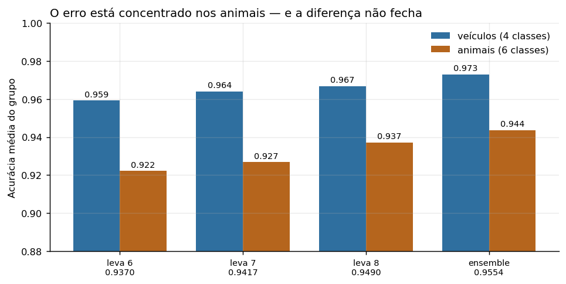

# Fase 2 — CNN para classificar o CIFAR-10

Treinar uma **CNN (Rede Neural Convolucional)** para classificar as imagens do
CIFAR-10 (10 classes, imagens RGB 32×32), buscando os melhores
hiperparâmetros — e comparar com o MLP da Fase 1.

**Resultado final: 0.9490 de acurácia no melhor modelo único e 0.9554 no
ensemble**, contra 0.5998 / 0.6135 do MLP da Fase 1. São **+34,9 pontos
percentuais** sobre o melhor resultado da fase anterior, ou uma redução de
88% na taxa de erro (de 38,6% para 4,5%).

## Estrutura

```
fase2-cnn/
├── README.md
├── pyproject.toml           # torna o pacote instalável (pip install -e .)
├── requirements.txt
├── src/cnn_cifar10/         # código reutilizável
│   ├── config.py            # ExperimentConfig: todos os hiperparâmetros de um experimento
│   ├── data.py              # download do CIFAR-10 + DataLoaders (treino/val/teste) + augmentation
│   ├── model.py             # classe CNN (blocos conv, kernel, stride, padding, pooling, GAP, cabeça densa parametrizáveis)
│   ├── metrics.py           # métricas globais + acurácia por classe
│   ├── train.py             # loop de treino/avaliação com early stopping + MixUp/CutMix
│   ├── checkpointing.py     # skill `model-saver`: salva model.pt + metadata.json de cada execução
│   ├── ensemble.py          # ensemble (soft voting) de modelos já treinados, sem retreinar
│   └── hierarchical.py      # experimento hierárquico: porteiro + especialistas
├── notebooks/
│   └── 01_train_cnn_cifar10.ipynb   # define e roda todos os experimentos
├── scripts/
│   └── add_round8_sections.py       # gera as seções 12-16 do notebook (edição programática do .ipynb)
├── data/                    # CIFAR-10 baixado automaticamente (não versionado)
└── results/                 # results/{model_id}/ — uma pasta por execução
    └── plots/report/        # gráficos usados neste README
```

A separação entre `src/` (implementação) e `notebooks/` (orquestração) segue o
mesmo padrão da Fase 1: o notebook fica curto e legível para quem vai avaliar
o relatório, e o código testável e reaproveitável fica isolado em módulos.

## Como rodar

### Local

```bash
cd miniprojeto/fase2-cnn
python -m venv .venv && source .venv/bin/activate   # ou .venv\Scripts\activate no Windows
pip install -e .
jupyter notebook notebooks/01_train_cnn_cifar10.ipynb
```

### Google Colab / Kaggle

Abra `notebooks/01_train_cnn_cifar10.ipynb` e rode a célula de setup — ela
clona o repositório, instala o pacote e ajusta `PROJECT_ROOT`/`DATA_DIR`/
`RESULTS_DIR` automaticamente.

No Kaggle, use **"Save Version" → "Save & Run All (Commit)"** em vez de rodar
interativamente. O modo commit executa o notebook num kernel gerenciado em
segundo plano, que não depende da aba do navegador ficar aberta nem da
conexão — uma sessão interativa é encerrada por inatividade e leva o
progresso junto. Os arquivos gerados em `/kaggle/working/` ficam disponíveis
na aba "Output" da versão, e podem ser baixados pela interface ou via
`kaggle kernels output <usuario>/<notebook> -p <pasta>`.

Os treinos mais longos desta fase (levas 6-8, redes VGG de 4 estágios com
120-200 épocas) levam **2-4 horas de GPU por configuração**, então cabem
confortavelmente no limite de 9h por sessão — mas não é viável rodar uma leva
inteira num único commit.

## Cada execução de treino é salva automaticamente (skill `model-saver`)

`train.fit(...)` chama `checkpointing.save_run(...)` ao final de cada
execução, criando `results/{model_id}/` com `model_id` único
(`cnn_{run_name}_{timestamp}`, nunca reutilizado), contendo `model.pt`
(pesos), `metadata.json` (hiperparâmetros, arquitetura, dataset, métricas,
acurácia por classe) e `history.csv` (loss/acurácia por época).

`train.fit_or_load(...)` torna o notebook **idempotente**: se já existe um
resultado salvo para aquele `run_name`, ele é reaproveitado em vez de
retreinado. Isso foi essencial nesta fase — com treinos de horas, reexecutar
o notebook do zero a cada sessão do Kaggle seria inviável.

---

# Relatório do experimento

## Objetivo e metodologia

Foi feita uma busca guiada em **8 levas** de 4-7 configurações cada,
totalizando **53 execuções de 10 classes** registradas em `results/`, mais 3
execuções do experimento hierárquico (que resolvem tarefas de 2, 4 e 6
classes) e 2 ensembles por soft voting sem retreino.

A busca é **gulosa/coordenada, não uma grade exaustiva**: cada leva testa
hipóteses derivadas do que a leva anterior revelou, e o vencedor de uma leva
vira a base da seguinte. O critério para decidir o que testar não foi
"variar tudo", e sim perguntar a cada rodada *qual fonte de erro ainda não foi
atacada*.

Todas as execuções usam CIFAR-10 (45.000 treino / 5.000 validação / 10.000
teste), entropia cruzada como perda e a mesma divisão de validação (seed 42),
exceto onde indicado.

## Evolução da acurácia de teste, leva a leva

| Leva | Melhor config | Acurácia | Ganho |
|---|---|---|---|
| 1 — variações isoladas | `baseline` — 2 blocos conv (32/64), Adam, sem batch norm | 0.7148 | — |
| 2 — combinando vencedores | `augment_batchnorm_deeper_cosine` — 3 blocos (32/64/128) + batch norm + augmentation + cosine | 0.8548 | +14,00 p.p. |
| 3 — esticando o vencedor | nenhuma config superou a leva 2 | 0.8548 | 0,00 p.p. |
| 4 — novos eixos | `combo_weight_decay_light` — + `weight_decay=5e-4` | 0.8722 | +1,74 p.p. |
| 5 — canais largos + SGD | `combo_wd_wider_sgd_long` — canais 64/128/256, SGD+momentum, 120 épocas | 0.8891 | +1,69 p.p. |
| 6 — arquitetura VGG | `vgg_4stage_gap_sgd` — 4 estágios (64/128/256/512), 2 convs por estágio, global average pooling | 0.9370 | **+4,79 p.p.** |
| 7 — regularização | `vgg4_randaugment` — campeão + RandAugment | 0.9417 | +0,47 p.p. |
| 8 — MixUp/CutMix | `vgg4_mixcut_aug_ls` — MixUp+CutMix+RandAugment+label smoothing+Nesterov, 200 épocas | **0.9490** | +0,73 p.p. |
| — | **Ensemble (soft voting)** de 7 modelos VGG-4, sem retreinar | **0.9554** | +0,64 p.p. sobre o melhor individual |





Duas coisas saltam dessa tabela. A primeira é que **o salto inicial (leva 1 →
2, +14 p.p.) veio de combinar três alavancas baratas** — profundidade, batch
normalization e data augmentation — e não de nenhuma delas isoladamente. A
segunda é que **a leva 3 foi um zero absoluto**: nenhuma das configurações que
esticavam o vencedor da leva 2 (mais filtros na cabeça densa, kernel maior,
4 blocos, learning rate maior com cosine) superou o ponto de partida. Esse
fracasso foi informativo — mostrou que o espaço "mesma família, parâmetros
maiores" estava esgotado, e foi o que motivou a leva 4 a procurar um eixo
diferente (regularização por weight decay) em vez de continuar aumentando a
rede.

## Configuração vencedora final

**Melhor modelo único — `vgg4_mixcut_aug_ls`** — acurácia de teste **0.9490**
(F1 0.9490), 200 épocas:

| Hiperparâmetro | Valor |
|---|---|
| Arquitetura conv | 4 estágios: 64 → 128 → 256 → 512 filtros |
| Convoluções por estágio | 2 (estilo VGG) — 8 camadas convolucionais no total |
| Kernel / stride / padding | 3×3 / 1 / 1 |
| Pooling | MaxPool 2×2 após cada estágio |
| Cabeça | `AdaptiveAvgPool2d(1)` (global average pooling) → Linear(512→256) → Linear(256→10) |
| Batch normalization | Sim, após cada convolução |
| Dropout | 0.0 |
| Otimizador | SGD, `momentum=0.9`, `nesterov=True` |
| Learning rate | 0.05 com cosine annealing |
| Weight decay (L2) | 5e-4 |
| Label smoothing | 0.1 |
| Data augmentation | RandomCrop(32, padding=4) + RandomHorizontalFlip + **RandAugment** |
| Mistura de amostras | **MixUp (α=0.2) + CutMix (α=1.0)**, alternados, em 50% dos batches |
| Épocas / paciência | 200 / 40 |
| Parâmetros | ~4,8 milhões |



**Melhor resultado geral — ensemble (soft voting) de 7 modelos** — acurácia
**0.9554** (F1 0.9553), combinando as probabilidades softmax dos sete modelos
VGG de 4 estágios das levas 6 e 7, **sem nenhum retreino** (só um forward pass
a mais no teste). Ver `src/cnn_cifar10/ensemble.py`.

| Ensemble | Membros | Acurácia |
|---|---|---|
| `ensemble_vgg4_top3` | os 3 melhores (`randaugment`, `trivial_aug`, `reg_combo`) | 0.9519 |
| **`ensemble_vgg4_all`** | **todos os 7 VGG-4 das levas 6-7** | **0.9554** |

Aqui vale registrar uma diferença em relação à Fase 1. No MLP, incluir os
modelos de maior acurácia individual **piorou** o ensemble — membros
correlacionados diluíam a média. Na CNN aconteceu o oposto: usar os 7 modelos,
incluindo os três empatados em 0.9370 (os "piores"), rendeu **+0,35 p.p. a
mais** do que usar só os 3 melhores. A explicação é que os sete foram treinados
com regularizadores *diferentes* (dropout, weight decay alto, label smoothing,
TrivialAugment, RandAugment), então mesmo os de acurácia igual erram imagens
diferentes. Diversidade continua sendo o que importa — só que aqui ela já
estava garantida por construção, e mais membros significavam mais diversidade,
não mais redundância.

## Acurácia por classe

| Classe | leva 7 (0.9417) | campeão (0.9490) | ensemble (0.9554) | hierárquico (0.9360) |
|---|---|---|---|---|
| airplane | 0.955 | 0.957 | 0.967 | 0.941 |
| automobile | 0.974 | 0.977 | 0.981 | 0.972 |
| bird | 0.927 | 0.942 | 0.937 | 0.920 |
| cat | 0.854 | 0.881 | **0.893** | 0.850 |
| deer | 0.945 | 0.953 | 0.969 | 0.953 |
| dog | 0.909 | 0.910 | **0.915** | 0.893 |
| frog | 0.965 | 0.970 | 0.975 | 0.950 |
| horse | 0.961 | 0.967 | 0.973 | 0.955 |
| ship | 0.964 | 0.968 | 0.975 | 0.963 |
| truck | 0.963 | 0.965 | 0.969 | 0.963 |



O ensemble melhora **9 das 10 classes** sobre o melhor modelo individual (só
`bird` piora, de 0.942 para 0.937), e os maiores ganhos estão justamente onde
mais precisava: `deer` +1,6 p.p., `cat` +1,2 p.p., `airplane` +1,0 p.p.

### O erro é concentrado, e nunca deixou de ser



| Grupo | leva 6 | leva 7 | campeão | ensemble |
|---|---|---|---|---|
| Veículos (airplane, automobile, ship, truck) | 0.9592 | 0.9640 | 0.9668 | **0.9730** |
| Animais (bird, cat, deer, dog, frog, horse) | 0.9222 | 0.9268 | 0.9372 | **0.9437** |
| **Diferença** | 3,7 p.p. | 3,7 p.p. | 3,0 p.p. | **2,9 p.p.** |

A diferença entre os dois grupos encolheu de 3,7 para 2,9 p.p. ao longo de
três levas, mas **nunca fechou**. No ensemble final, de 446 erros no total,
`cat` (107) e `dog` (85) sozinhos respondem por **43%** — quase o dobro do
que sua participação proporcional (20%) sugeriria. Esse é exatamente o mesmo
par que dominava os erros do MLP na Fase 1, o que diz algo importante: a
convolução resolveu quase tudo, menos a distinção mais fina entre duas classes
de animais peludos de quatro patas em 32×32 pixels.

## O que a busca revelou sobre cada hiperparâmetro

**Profundidade real (convoluções por estágio) foi a maior alavanca isolada de
toda a busca.** Passar de 1 para 2 convoluções antes de cada pooling
(`conv_layers_per_block=2`, estilo VGG) levou de ~0.889 para 0.90+ mantendo
todo o resto igual — e, combinada com o quarto estágio, produziu o salto de
+4,79 p.p. da leva 6. A distinção importa: aumentar o número de *estágios*
(cada um reduzindo a resolução pela metade) tem um limite físico em imagens
32×32, mas empilhar convoluções *dentro* do mesmo estágio aumenta a
profundidade e o campo receptivo sem encolher mais o mapa espacial.

**SGD + momentum + cosine bateu Adam por ~3 p.p. em redes fundas.** As duas
versões Adam da arquitetura VGG ficaram em ~0.90 (`vgg_2conv_gap` 0.9017,
`vgg_2conv_per_block` 0.9007); as mesmas redes com SGD foram a ~0.93
(`vgg_2conv_sgd` 0.9332). Esse é um dos achados mais úteis da fase porque
inverte o padrão da Fase 1, onde Adam era a escolha padrão e SGD não trouxe
vantagem no MLP. A diferença aparece justamente quando a rede fica funda.

**Global average pooling** (substituir o achatamento denso por
`AdaptiveAvgPool2d(1)`) cortou a maior parte dos parâmetros da cabeça densa
e regularizou de graça — foi adotado do campeão da leva 6 em diante.

**Weight decay tem um ponto ótimo estreito em 5e-4.** Foi a alavanca vencedora
da leva 4 (+1,74 p.p.); dobrar para 1e-3 (`vgg4_wd_higher`) não mudou nada
(0.9370) e 1,5e-3 (`combo_wd_stronger`) piorou claramente (0.8659).

**Dropout nunca ajudou, em nenhuma família.** Testado na rede rasa
(`dropout_03` 0.7130, `combo_dropout_tiny` 0.8351), na VGG de 3 estágios
(`vgg_2conv_dropout` 0.9284 contra 0.9332 sem) e na VGG de 4 estágios
(`vgg4_dropout` 0.9370, empatado com o baseline). Com batch normalization e
augmentation já presentes, o dropout só atrapalha a convergência — mesmo
padrão que o weight decay teve no MLP da Fase 1.

**Augmentation automática forte foi melhor que augmentation manual forte.**
`RandAugment` (0.9417) e `TrivialAugmentWide` (0.9411) superaram tanto o
crop+flip simples (0.9370) quanto o color jitter manual, que **piorou** nas
duas vezes que foi testado (`combo_strong_augment` 0.8489;
`vgg_2conv_sgd_strong_aug` 0.9222 contra 0.9332 sem). Vale notar que o color
jitter também tinha piorado o MLP na Fase 1 — é a alavanca mais consistentemente
negativa dos dois projetos.

**MixUp e CutMix foram o que quebrou o platô de 0.94.** Isoladamente, MixUp
(0.9443) e CutMix (0.9429) já superaram toda a leva 7; alternados
(`vgg4_mixcut_both` 0.9469) somaram mais; e combinados com RandAugment,
label smoothing e Nesterov chegaram a **0.9490**. É a mesma lição da rodada 6
da Fase 1 em outra roupagem: quando a busca satura, o ganho vem de **mudar a
categoria de alavanca**, não de ajustar melhor a que já se estava usando.

**Label smoothing sozinho calibra mas não acerta mais.** Na leva 7 levou a
`train_loss` de 0.006 para 0.506 — ou seja, tirou quase toda a superconfiança
da rede — e mesmo assim rendeu só +0,19 p.p. Isso foi um diagnóstico útil: o
problema não era calibração, era falta de variedade nos dados de treino, que é
o que MixUp/CutMix atacaram na leva seguinte.

**Normalização real do CIFAR-10** (média/desvio reais em vez de [-1,1])
piorou levemente (`combo_real_norm` 0.8347 contra 0.8548) — exatamente o mesmo
resultado contra-intuitivo da Fase 1, e provavelmente pela mesma razão: com
batch normalization, a escolha da normalização de entrada perde relevância.

**Hiperparâmetros que quase não importaram:** kernel 5×5 (pior que 3×3 nas
duas vezes), `stride=2` sem pooling (0.6430, de longe o pior da leva 1),
`padding=0`, batch size 64 contra 32, e GELU no lugar de ReLU. Learning rate
alto sem schedule foi o pior resultado absoluto do projeto (`lr_high` 0.6175).

## O experimento hierárquico: uma hipótese bem motivada que não funcionou

Depois da leva 7, a análise por classe mostrava veículos em 0.964 e animais em
0.927. A hipótese natural: se uma rede não precisasse gastar capacidade
separando gato de caminhão, poderia se dedicar inteiramente a separar gato de
cachorro. Foram treinadas três redes com a arquitetura do campeão:

| Rede | Tarefa | Dados de treino | Acurácia na própria tarefa |
|---|---|---|---|
| `hier_gate` | veículo vs. animal (2 classes) | 45.000 | 0.9875 |
| `hier_vehicle` | airplane/automobile/ship/truck (4) | 17.995 | 0.9718 |
| `hier_animal` | bird/cat/deer/dog/frog/horse (6) | 27.005 | 0.9298 |

Recompondo as 10 classes por `P(classe) = P(super) · P(classe | super)`:

| Configuração | Acurácia |
|---|---|
| Hierárquico composto | **0.9360** |
| Melhor modelo único achatado | 0.9490 |
| Hierárquico com porteiro perfeito (oráculo) | 0.9466 |

**O hierárquico perdeu por 1,3 p.p.**, e o diagnóstico do oráculo mostra
exatamente por quê. Mesmo *eliminando completamente* os erros do porteiro, a
composição chegaria só a 0.9466 — ainda abaixo do modelo achatado. Ou seja, o
problema não é o porteiro (que acerta 98,75%), são os especialistas.

A razão é a quantidade de dados. O especialista em animais viu 27.005 imagens
em vez de 45.000, e chegou a 0.9298 nas suas 6 classes — enquanto o modelo
achatado, treinado nas 45.000, atinge 0.9372 **nessas mesmas 6 classes**. As
outras 18.000 imagens de veículos, que o especialista nunca viu, ensinam
representações de baixo nível (bordas, texturas, gradientes) que continuam
úteis para classificar animais. Separar as tarefas destrói esse
aproveitamento compartilhado, e os 1,25% de erro do porteiro ainda são
somados por cima.

É um resultado negativo, mas dos mais informativos do projeto: mostra
concretamente que **em redes profundas as camadas iniciais são
compartilhadas**, e que dividir o problema em sub-redes independentes joga
fora esse compartilhamento. A abordagem correta para explorar a mesma
intuição seria uma única rede com um tronco convolucional comum e duas
cabeças especializadas, treinada de ponta a ponta — aí o especialista em
animais aproveitaria as features aprendidas também com veículos.

## Dá para melhorar mais?

Dentro da família testada, o retorno está claramente caindo. A leva 7 rendeu
+0,47 p.p., a leva 8 +0,73 p.p. e o ensemble +0,64 p.p. — todos abaixo de
1 p.p., contra os +14 p.p. da leva 2 e +4,8 p.p. da leva 6. Os ganhos agora
são da ordem de duas a três vezes o erro padrão da medida (±0,22 p.p. numa
acurácia de ~0.95 com 10.000 imagens de teste), ou seja, reais mas pequenos.

O que ainda renderia, em ordem de impacto esperado:

1. **Conexões residuais (ResNet).** É a única mudança estrutural de peso que
   não foi testada, e é o que permite treinar redes bem mais fundas sem
   degradar o gradiente. ResNets de tamanho comparável chegam a 0.95-0.96
   como modelo único no CIFAR-10.
2. **Ensemble de seeds.** Treinar 3 seeds da configuração campeã e ensemblar.
   O ensemble atual usa modelos de acurácia 0.937-0.9417; um ensemble de três
   modelos de 0.9490 deve render mais.
3. **Treino mais longo (300-400 épocas) com a receita da leva 8.** As curvas
   do campeão ainda não estavam completamente planas em 200 épocas.
4. **Uma rede de tronco compartilhado com duas cabeças**, pelo raciocínio da
   seção anterior — a versão que de fato testaria a hipótese hierárquica sem
   o custo de fragmentar os dados.
5. **Test-time augmentation**: promediar predições da imagem original e da
   espelhada. Custo quase zero, tipicamente +0,2-0,4 p.p.

O que já é seguro afirmar é que o teto estrutural do MLP foi superado com
folga. A comparação completa entre as duas fases está em
[`../comparativo/`](../comparativo/).
