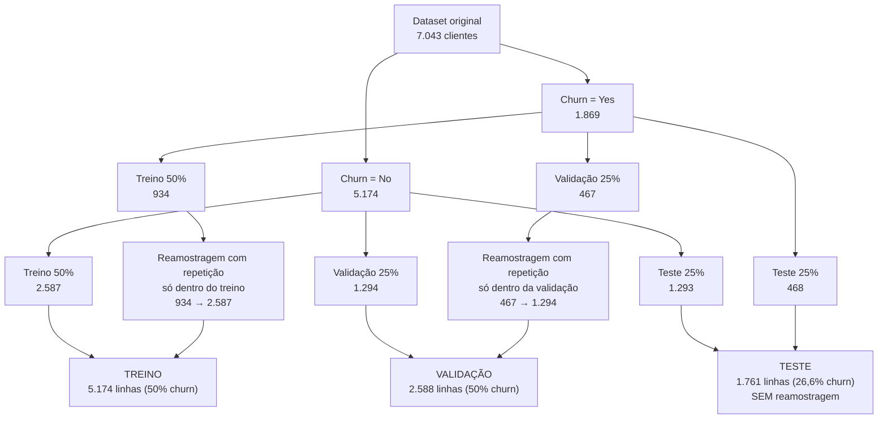

# Divisão e preparação dos dados — verificação de vazamento

Este documento descreve como o dataset de churn foi dividido e preparado,
para que seja possível conferir se existe vazamento de informação entre treino,
validação e teste. Todos os números abaixo são da partição principal
(semente 0), usada em todos os experimentos salvos em `results/`.

---

## 1. Dataset de partida

| Item | Valor |
|---|---|
| Linhas (clientes) | 7.043 |
| Colunas | 21 (`customerID` + 19 variáveis explicativas + `Churn`) |
| `customerID` único por linha? | Sim, nenhum cliente aparece duas vezes |
| Churn = No | 5.174 (73,5%) |
| Churn = Yes | 1.869 (26,5%), a classe minoritária |

`customerID` é descartado antes da modelagem. Nenhuma outra variável foi
removida.

---

## 2. Procedimento de divisão (3 etapas, por classe)

Passo a passo:

1. **Separação por classe.** O dataset é dividido em dois grupos, clientes
   que saíram (`Yes`) e clientes que ficaram (`No`).
2. **Divisão 50/25/25 dentro de cada classe.** Cada grupo é embaralhado e
   cortado em 50% treino, 25% validação e 25% teste. Assim a proporção de
   churn fica igual nas três partições antes de qualquer balanceamento.
3. **Reamostragem com repetição da classe minoritária, só em treino e
   validação.** Os clientes `Yes` de cada partição são sorteados com
   repetição até igualar o número de `No` daquela mesma partição. O sorteio
   do treino só usa clientes do treino, e o da validação só usa clientes da
   validação. Nenhuma cópia passa de uma partição para outra.
4. **Recombinação e embaralhamento** das duas classes dentro de cada
   partição.

**O teste nunca é reamostrado.** Ele mantém a proporção real de churn
(~26,6%) e cada cliente aparece nele uma única vez. Se o teste também fosse
balanceado por cópia, as métricas ficariam infladas (sobretudo recall e F1)
e o resultado não representaria a população real.

---

## 3. Tamanho final de cada partição

| Partição | Linhas | Clientes distintos | Churn = No | Churn = Yes | % churn |
|---|---:|---:|---:|---:|---:|
| Treino (com reamostragem) | 5.174 | 3.461 | 2.587 | 2.587 | 50,0% |
| Validação (com reamostragem) | 2.588 | 1.726 | 1.294 | 1.294 | 50,0% |
| **Teste** | **1.761** | **1.761** | **1.293** | **468** | **26,6%** |
| *Treino original (sem reamostragem)* | 3.521 | 3.521 | 2.587 | 934 | 26,5% |
| *Validação original (sem reamostragem)* | 1.761 | 1.761 | 1.294 | 467 | 26,5% |

Leitura da tabela:

- Treino e validação têm **mais linhas do que clientes distintos** porque os
  churners foram copiados. Como o sorteio é com repetição, alguns churners
  aparecem várias vezes e outros nenhuma (874 dos 934 churners de treino
  foram sorteados pelo menos uma vez; na validação, 432 dos 467).
- No teste, linhas = clientes distintos = 1.761. Não há nenhuma cópia.
- Treino original + validação original + teste = 3.521 + 1.761 + 1.761 =
  **7.043**, exatamente o dataset inteiro. Nenhum cliente foi perdido ou
  colocado em duas partições.

As versões "sem reamostragem" (em itálico) são as mesmas partições antes do
passo 3. Elas são usadas nos modelos que tratam o desbalanceamento por peso
de classe (`class_weight` / `scale_pos_weight`) e, nos modelos avançados, no
TabPFN e no Mitra (ver seção 6).

---

## 4. Checagens automáticas de vazamento

Toda vez que os dados são divididos, antes de qualquer treino, o pipeline
confere o seguinte:

| Checagem | Resultado |
|---|---|
| Algum cliente original aparece em treino **e** validação? | Não (interseção vazia) |
| Algum cliente original aparece em treino **e** teste? | Não (interseção vazia) |
| Algum cliente original aparece em validação **e** teste? | Não (interseção vazia) |
| A união das três partições cobre o dataset inteiro, sem sobreposição? | Sim (7.043 clientes) |

Se qualquer uma dessas condições falhar, a execução é interrompida com erro.

A checagem roda no pipeline de dados, nos baselines, na busca de
hiperparâmetros, na engenharia de features, no notebook do Kaggle (modelos
avançados) e em cada uma das 5 partições da avaliação robusta.

---

## 5. Pré-processamento: o que é aprendido e de onde

Regra geral: **tudo que depende de alguma estatística dos dados é ajustado
apenas no treino** e depois aplicado, sem reajuste, em validação e teste.

| Etapa | O que faz | Aprende algo dos dados? | Ajustado em |
|---|---|---|---|
| Remoção de `customerID` | Descarta o identificador | Não | — |
| Conversão de `TotalCharges` | Texto → número | Não | — |
| Imputação de `TotalCharges` | Brancos (clientes com `tenure = 0`) viram 0, porque esses clientes ainda não foram cobrados | Não (regra fixa, não usa média nem mediana) | — |
| Codificação binária | `gender`, `Partner`, `Dependents`, `PhoneService`, `PaperlessBilling` → 0/1 | Sim (quais níveis existem) | **Só treino** |
| One-hot | 10 variáveis categóricas com 3+ níveis | Sim (lista de categorias) | **Só treino** |
| Padronização (z-score) | `tenure`, `MonthlyCharges`, `TotalCharges`, `SeniorCitizen` | Sim (média e desvio-padrão) | **Só treino** |
| Codificação do alvo | `Churn`: Yes → 1, No → 0 | Não | — |

Detalhes relevantes:

- Uma categoria que só aparecesse em validação ou teste viraria "todas as
  colunas = 0". Ela nunca cria uma coluna nova, então o formato da entrada
  não depende dos dados de validação ou teste.
- Para confirmar, a média usada na padronização foi comparada com a média do
  dataset inteiro. Os valores são diferentes, o que mostra que o ajuste usou
  só o treino.
- Resultado: 40 colunas de entrada após a codificação, iguais nas três
  partições.
- A feature derivada testada na engenharia de features
  (`charges_per_tenure`) segue a mesma regra: média e desvio da padronização
  vêm só do treino.

---

## 6. Como cada partição é usada

| Partição | Usada para | Nunca usada para |
|---|---|---|
| **Treino** | Ajustar os pesos dos modelos e o pré-processamento | Escolher hiperparâmetros ou reportar resultado |
| **Validação** | Early stopping (MLP, STab, KAN, TabKAN), busca de hiperparâmetros (Optuna, maximizando KS), escolha de features derivadas, escolha dos modelos do ensemble "top 3" | Ajustar pesos ou pré-processamento |
| **Teste** | Calcular as métricas finais, uma única vez por modelo, depois de todas as escolhas feitas | Qualquer decisão de modelagem |

Observações:

- Na busca de hiperparâmetros e na engenharia de features, o teste só foi
  usado depois de escolhido o vencedor na validação. Os relatórios mostram
  que os ganhos vistos na validação **não se confirmaram no teste**
  (ex.: Gradient Boosting com KS 0,571 na validação caiu para ~0,510 no
  teste). Esse comportamento é o esperado quando o teste não influenciou
  nenhuma escolha.
- **TabPFN e Mitra** aprendem "em contexto", ou seja, recebem as linhas de
  treino como exemplos. Linhas duplicadas distorcem esse tipo de modelo, por
  isso eles também foram rodados com o **treino original sem reamostragem**
  (3.521 linhas, versões `*_sem_duplicatas`). Depois, as probabilidades
  passam por uma correção de prior (reescala das odds para a proporção 50%).
  Essa correção usa só a proporção de churn do treino e não altera a
  ordenação das previsões, então o KS e o AUROC não mudam.
- O ensemble "top 3" escolhe os modelos pelo desempenho na **validação**.
  O teste só é usado para medir o ensemble já escolhido.

---

## 7. Avaliação robusta (5 partições)

Como o teste tem só ~470 churners, o KS de uma única partição tem
erro-padrão de ~0,02, maior que a diferença entre a maioria dos modelos.
Por isso o procedimento inteiro foi repetido com as **sementes 0 a 4**. Em
cada semente:

1. Nova divisão de 3 etapas (seções 2 e 3), do zero.
2. As checagens de vazamento da seção 4.
3. Pré-processamento reajustado do zero, só no treino daquela semente.
4. Treino, validação e teste exatamente como na seção 6.

Nenhum objeto (pré-processamento, modelo ou escolha de hiperparâmetro) é
reaproveitado de uma semente para outra. Os resultados estão em
`reports/tables/avaliacao_robusta_resumo_kaggle.csv` (média ± desvio por
modelo) e `avaliacao_robusta_por_particao_kaggle.csv` (por semente).

---

## 8. Pontos de atenção (transparência)

Nenhum destes itens é vazamento entre partições, mas eles foram registrados
para facilitar a revisão:

1. **Validação balanceada por cópia.** A validação também tem churners
   repetidos (só cópias de clientes da própria validação). Na prática, cada
   churner da validação pesa ~2,8× mais no early stopping e no KS de
   validação. Isso muda a escala da loss de validação, mas não traz nenhuma
   informação do teste.
2. **Clientes diferentes com dados idênticos.** Há 73 clientes (todos com
   `tenure = 1`) cujas 19 variáveis explicativas são idênticas às de outro
   cliente, formando 33 grupos. São clientes diferentes (`customerID`
   distintos), tipicamente recém-chegados com plano mínimo. Pela divisão
   aleatória, 17 desses grupos têm membros em partições diferentes, e 8 deles
   incluem o teste. Como são pessoas distintas, não é vazamento, e o efeito
   possível é desprezível (poucas linhas entre 1.761 do teste). Mesmo assim,
   fica registrado.
3. **EDA no dataset inteiro.** A análise exploratória (`00_eda`) foi feita
   com as 7.043 linhas, antes da divisão. Ela foi só descritiva e serviu
   para sugerir as 3 features derivadas testadas na engenharia de features.
   A escolha final de features foi feita só na validação, e nenhuma delas
   foi incorporada ao modelo de referência.
4. **Imputação de `TotalCharges`.** Os 11 valores em branco são todos de
   clientes com `tenure = 0`. Eles foram preenchidos com 0 por regra lógica
   (o cliente ainda não foi cobrado), sem usar estatísticas de nenhuma
   partição.

---

## 9. Onde conferir

| O quê | Arquivo |
|---|---|
| Tamanhos e proporções das partições | `reports/tables/pipeline_resumo_particoes.csv` |
| Lista das 40 colunas após a codificação | `reports/tables/pipeline_colunas_apos_encoding.csv` |
| Execução do pipeline com as checagens impressas | `notebooks/01_data_pipeline.ipynb` |
| Auditoria de vazamento nos baselines | `notebooks/02_baselines.ipynb`, seção 3 |
| Resultados por semente (avaliação robusta) | `reports/tables/avaliacao_robusta_por_particao_kaggle.csv` |
